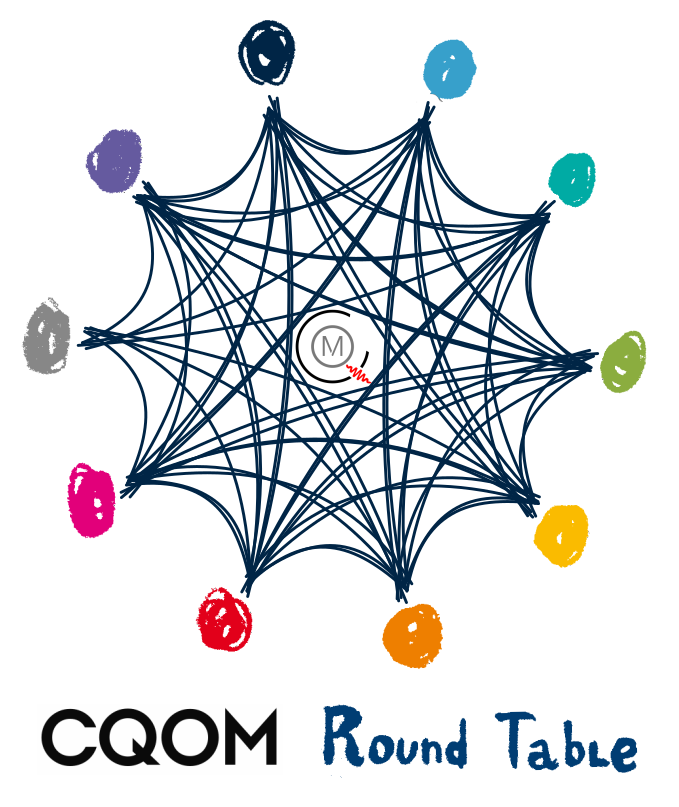

Teaching
========

I have been involved in teaching, course/competition creation, marking,
and supervision at all levels of physics eduction (primary school -> highschool 
-> undergraduate -> postgraduate).

Selected materials
------------------

.. image:: _static/Rydberg_physics_cover.jpg
   :width: 150
   :align: right

* Free, interactive `introductory eBook to Rydberg physics`_ for advanced undergraduate and new postgraduates, covers introduction to highly excited Rydberg states in atoms and solid state, and their applications in quantum optics, metrlogy and quantum simulation.

* Physics world `blogpost`_ and `article`_ about using interactive materials to enhance learning and improve discussion of ideas is available here.

Additionally, check ResearchX3D, Roundtable and Caroline projects that can
be used to support both teaching and suppport on `Knowledge infrastructure page`_

.. _introductory eBook to Rydberg physics : https://iopscience.iop.org/book/978-0-7503-1635-4/chapter/bk978-0-7503-1635-4ch1

.. _blogpost : https://physicsworld.com/a/do-interactive-figures-help-physicists-to-communicate-their-science/

.. _article : https://iopscience.iop.org/article/10.1088/2058-7058/32/5/22

.. _Knowledge infrastructure page : ./knowledge.html

Round table meetings 
--------------------

I have been organizing meeetings of early stage researchers (PhDs and postdocs),
connecting different groups in  department, using **a new format of meetings** to 
focus on efficient communication
of transferable ideas. For more details on methodology of
the meetings check the `infographics`_.

.. _infographics : _static/roundtable_meetings.pdf