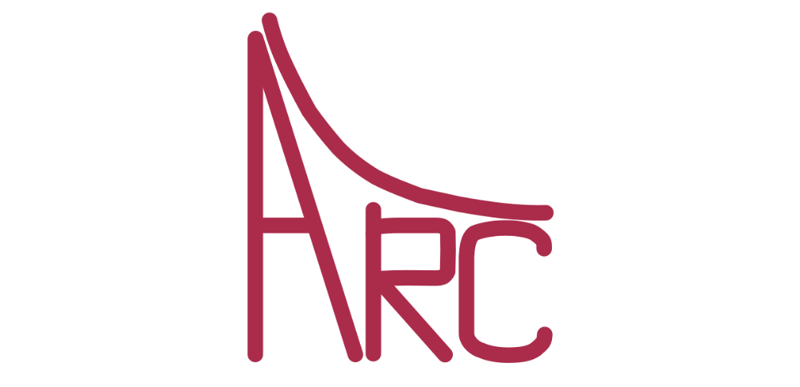
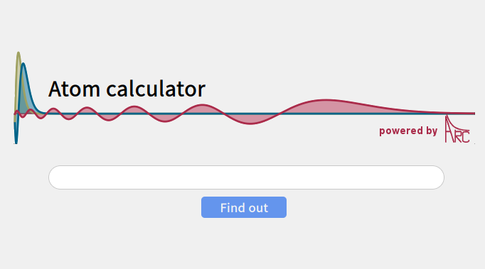
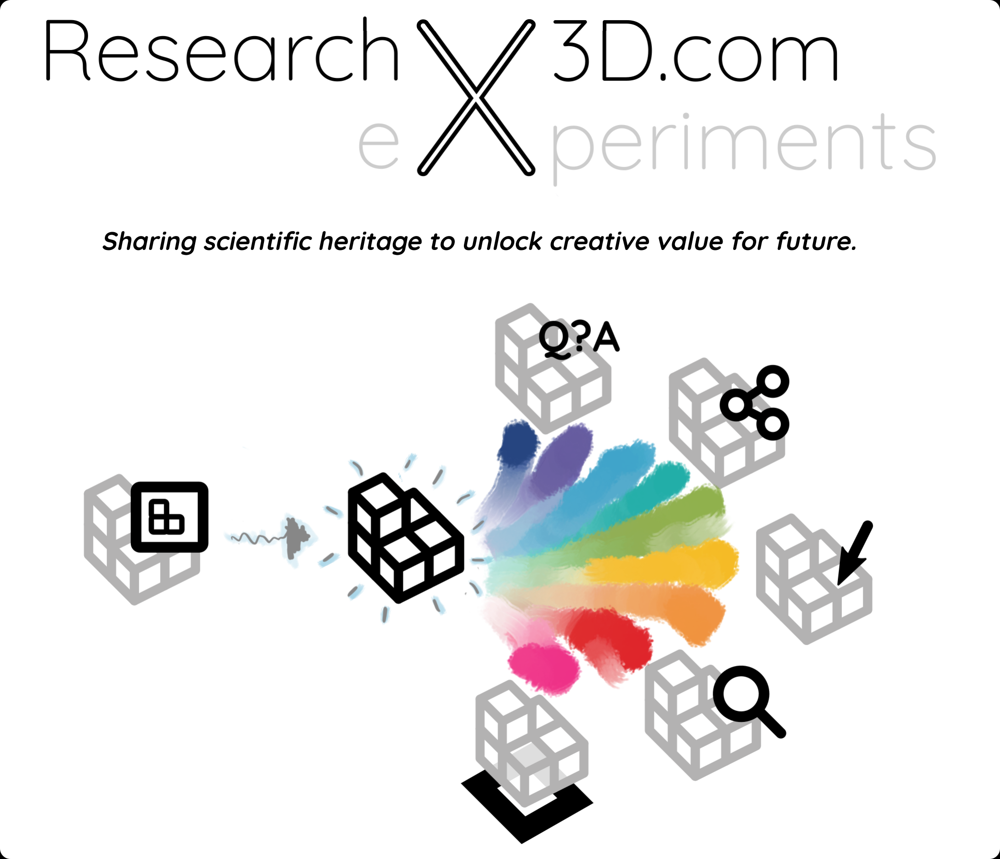
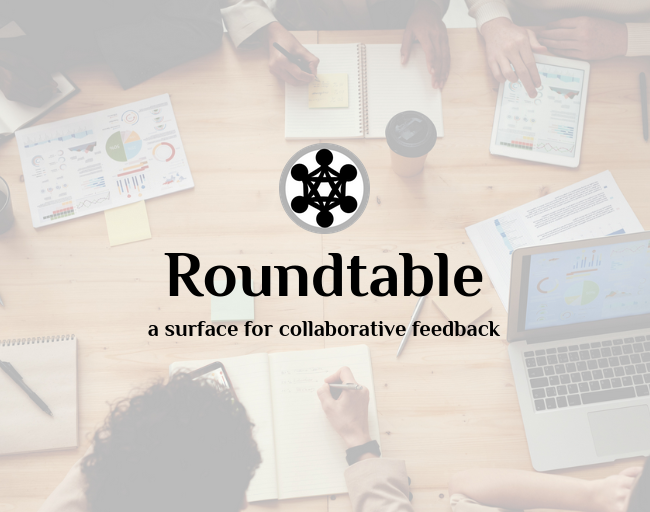
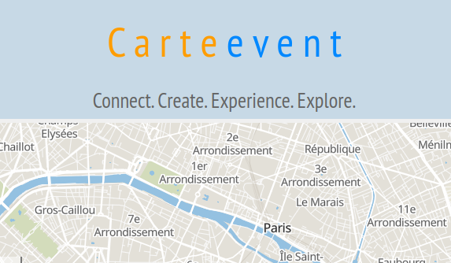

:og:description: Knowledge infrastructure. Software and web services for sharing and interacting with academic knowledge.

.. raw:: html

    

Knowledge infrastructure
========================

**Why?** Many of the important `challenges we face as humanity`_  rely on coordinated work of many experts and organizations. To be able to mobilize society-wide response to raise up to the scale of the challenge, we need to enable knowledge to be not only more easily accessible, but also more easily reused by domain non-experts. We also need more transparency into origins of expert insights, to enable progression when expert opinions differ, and to enable feedback from non-experts that might crucially expand our solution-space horizons. Existing solutions of knowledge dissemination and reuse are not fit for the scale of interdisciplinarity and coordination we have to achieve: we need a new knowledge infrastructure.

.. sidebar:: Quote

   "E.B. White, one of our last great idealists, was eternally right when he asserted half a century ago that the role of the writer is “to lift people up, not lower them down” — a role each of us is called to with increasing urgency, whatever cog we may be in the machinery of society. Supply creates its own demand. Only by consistently supplying it can we hope to increase the demand for the substantive over the superficial — in our individual lives and in the collective dream called culture."
   — `Maria Popova`_

.. _`Maria Popova` : https://www.themarginalian.org/2019/10/23/13-learnings-13-years/

**What?** If we make good interfaces for finding and reusing knowledge, we can enable society-wide collaboration. Many people pointed in the similar direction over the history, from `Vannevar Bush in "As we may think"`_ (The Atlantic, July 1945),
over `Douglas C. Engelbart in "Augmenting Human Intellect: A Conceptual Framework"`_ (October 1962)
to `Bret Victor in "The Humane Representation of Thought"`_ (2014). What is maybe now more evident than ever is that knowledge accessibility is only the first step toward knowledge reuse and application in everyday life. A new knowledge interface has to enable better and easier learning, reuse and communication across the domain and societal boundaries.

**How?** By combining information technology at its best with physicists' approach of progressive problem solving, it might be possible to provide necessary tools. The Internet is the perfect way to deliver these tools world-wide, and open-source is the only way to actively engage with a diverse community. Specific realized projects, which continue to be maintained and enlarged, are presented below.

.. _`challenges we face as humanity` : https://ourworldindata.org/problems-and-progress
.. _`Vannevar Bush in "As we may think"` : https://www.theatlantic.com/magazine/archive/1945/07/as-we-may-think/303881/
.. _`Douglas C. Engelbart in "Augmenting Human Intellect: A Conceptual Framework"` : https://www.dougengelbart.org/content/view/138
.. _`Bret Victor in "The Humane Representation of Thought"` : https://vimeo.com/115154289

.. tip::
        For "live" services below you can verify status at `Service status`_ page.

.. _`Service status`: https://nikolasibalic.github.io/status/

Research, teaching & collaboration
----------------------------------

ARC (Alkali.ne Rydberg Calculator)
**********************************

ARC (Alkali.ne Rydberg Calculator) is package of routines written in Python,
using object-oriented programming (OOP) to make modular, reusable and extendable
collection of **routines and data** for performing useful calculations of single
atom and two-atom properties, like level diagrams, interactions and
transition strengths for alkali and divalent atoms. Gradually extended to
be all-encompasing Python toolbox for atomic-physics calculations.

.. grid:: auto

    .. grid-item::

        .. button-link:: https://github.com/nikolasibalic/ARC-Alkali-Rydberg-Calculator
                :color: info
                :shadow:

                See on GitHub

    .. grid-item::

        .. button-link:: https://arc-alkali-rydberg-calculator.readthedocs.io/en/latest/
                :color: info
                :shadow:

                Documentation & examples

Atom calculator
***************

Web applications providing not only simple interface to ARC, but also generic
scheduling of complex longer calculations, notificatoins when calculations
are done, retrival of similar calculations, and interactive plots.
This lowers boundary to use of scientific knowledge, by
**bringing state-of-the-art AMO knowledge from labs to pubs.**

.. grid:: auto
    
    .. button-link:: https://atomcalc.org/
        :color: info
        :shadow:

        Open webapp

ResearchX3D
***********

All science is **experimental** by definition, yet designing new experimental
apparatus is usually not being explored with much detail in education. This
is hard 3-dimensional problem, that requires interdisciplinary knowledge.
ResearchX3D collects 3D models and makes also photogrametic reconstructions
based on submited photographs of scientific apparatus from around the world.
Models can be anotated with 3D pointers to "show-and-tell", sound, equations,
figures... and everything is available on 28 langauges. sorted by knowledge
level (from primary school to research level).

.. grid:: auto

    .. grid-item::

        .. button-link:: https://www.researchx3d.com
            :color: info
            :shadow:

            Open webapp

    .. grid-item::

        .. button-link:: https://www.youtube.com/watch?v=LZDBc406JmY
            :color: info
            :shadow:

            Video introduction

Roundtable
**********

In real life meetings around Roundtable everyone can point and add their
sketched idea on the presented material. Now we extend that experience for
meetings with physical distancing, with many participants, or even with
participants distributed around the world. Have engaging meetings with
collaborative feedback using this distributed discussion surface!
This is **made for scientific discusisons**, supports sharing and collective
exploratoin and annotation of pdf, images, source-code, Jupyter notebooks,
with free hand or with typed annotations (LaTeX included). You can download
annotated samples and shared files. Everything is stored just among peers.

.. grid:: auto

    .. grid-item::

        .. button-link:: https://roundtable.researchx3d.com
            :color: info
            :shadow:

            Open webapp

Caroline
********

Caroline is open-source Python framework for interactive web/HTML+JS based
science presentations. With Caroline you can **show and annotate everything**.
Interface is minimalistic and focus is on content. Caroline blurs distinction
between slides and whiteboard, between demonstration and derivation, and
smoothly even crosses from one way lecturing to interacting with the audience
**allowing real-time note-taking, quizzes and even all-to-all collaboration**.
Caroline is made specifically not just to impress the audience but to allow
you to do everything you possibly can to reach "aha!" moment of understanding
and inspiration, 

.. grid:: auto

    .. grid-item::

        .. button-link:: https://github.com/nikolasibalic/Caroline
            :color: info
            :shadow:

            Open on GitHub

Interactive Publishing
**********************

.. image::  _static/interactive-publishing.png
    :width: 350
    :align: right  

This project provides quick starting point for anyone who wants to experiment
with interactive text and figures in their electronic publications 
(EPUB3 / HTML5 + JavaScript). One possible reason why one would use
**interactive text and figures** is to communicate many possible stories to the
audience, instead of usual single story line. See Physics World blogpost.

.. grid:: auto

    .. grid-item::

        .. button-link:: https://nikolasibalic.github.io/Interactive-Publishing/
            :color: info
            :shadow:

            Documentation and examples

    .. grid-item::

        .. button-link:: https://github.com/nikolasibalic/Interactive-publishing
            :color: info
            :shadow:

            Open on GitHub

    .. grid-item::

        .. button-link:: https://physicsworld.com/a/do-interactive-figures-help-physicists-to-communicate-their-science/
            :color: info
            :shadow:

            Physics World blogpost

Society
-------

Carteevent
**********

Simple web service that **mines cultural events** in Paris and around and **geolocalizes**
them on the map. Events are sorted categorized, and events with
category **tags can be searched using logical AND and OR operators**. This enables powerful features:
instead of searching for individual "dancing", "exposition"
tags, you can easily see a map of "swing dancing or photo exposition" events
for example. It allows saving the list of selected events and map views
in your **local browser memory** too, giving strong privacy protection.

.. grid:: auto

    .. grid-item::

        .. button-link:: https://www.carteevent.com
            :color: info
            :shadow:

            Open webapp
